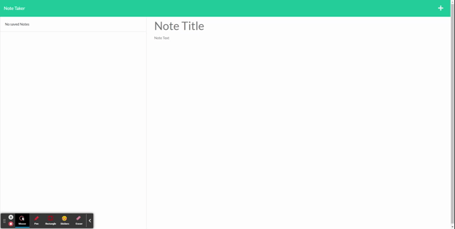

# Note-Taker
Express-Yourself
## Description

This project was used to further my understanding of routes and heroku

## Table of Contents

 - [Installation](#installation)
 - [Usage](#usage)
 - [Credits](#credits)
 - [License](#license)

## Installation

To use this project the user needs download the project and open it in vscode. then the user needs to open the terminal for the project and type "npm start" into the terminal then open http://localhost:3000. it can also be reached on github live pages from this link https://johnboy514.github.io/Work-Scheduler/ and on this heroku link https://note-taker-app-best.herokuapp.com/notes

## Usage

to utilize this page the user may type in the title section to begin a note, after the user can write their note below that. once satisfied the user can hit the save icon in the top right to save the file. if a save is undesired the user can hit the trashcan icon to delete the note on the left.

## Credits

Robert Obernier
https://github.com/rjo6615

## License

N/A